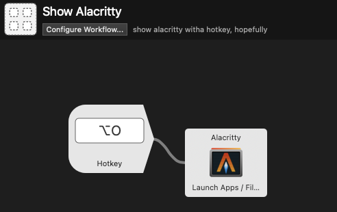

# Expensively recreating my i3 scratch window workflow in Mac OS

This is not really a recommendation but rather a note for myself that I have come across this "solution", for whatever of its problems.

## Summary

* This solution works kind of okay
* But it doesn't seem to be able to target binaries from my Nix store (e.g. gui emacs) -- this I may work around by using a different distribution of Emacs anyway
* There is some considerable delay between the hotkey press and the actual action (100+ ms)
* It costs 60GBP or more

## What is an i3 scratch window workflow?

When you use scratch windows in i3, it's kind of like using normal windows in a typical window manager. They come to the foreground, you can resize them at will, drag them around, etc.

The nice thing you can do with i3 is that you can set keyboard shortcuts to anything, and in my case, I set keyboard shortcuts to toggle the display of floating windows for Slack, my terminal, other chat programs, mpv, etc. I use sup+u, sup+o, sup+i, etc. for toggling these scratch windows.

The aim is to get to the window I want to do something on and hide the window when I no longer need it. The windows I actually want to do work on stay in the tiles and I move between them, usually just as horizontal splits with tabs on each side. Like this kind of layout:

```
|--browser-|--emacs---|
|--browser-|--emacs---|
|--browser-|--emacs---|
|          |          |
|          |          |
|__________|__________|

|--browser-|--emacs---|
|--br.___________.s---|
|--br|           |s---|
|    |   slack   |    |
|    |___________|    |
|          |          |
|__________|__________|
```

## Automator quick actions bound to keyboard shortcuts in the Mac OS settings only works for some cases

While you can create a quick action in Automator to launch applications that will bring them to the foreground if the application is already open, settings the hotkeys to these quick actions seems to only work in applications that do not override keyboard handling, so while this may work in Finder, this does not work in Chrome or gui Emacs.

It seems I could try to bind a key to `automator` to call a specific workflow I define, but this seems to still pay a big startup time penalty of easily 250+ ms. Maybe this is what is preferable for powerusers of karabiner-Elements.


## The expensive solution with Alfred Powerpack

I believe I've used Alfred before until 2017 or something, but I never bothered with the 60GBP version of it called "Powerpack". For the cost of a video game, I'm able to use their visual programming environment feature called "Workflows" to add a workflow that triggers on a hotkey to launch/toggle visibility on applications. Like so:



This still incurs some kind of startup penalty of 100+ ms, but it is not quite as bad as waiting around for Automator.


## Looking for better solutions

I would still like a better solution, but I don't want a solution like "bind cmd-[1-9] to applications on the dock" because I still need to use those on various apps like Chrome.

## Future work

There might be something interesting to look into in <https://github.com/koekeishiya/skhd>, used by the <https://github.com/koekeishiya/yabai> window manager.

I might have to more seriously consider using a VM to use Linux instead while using Mac OS for everything audio related.
